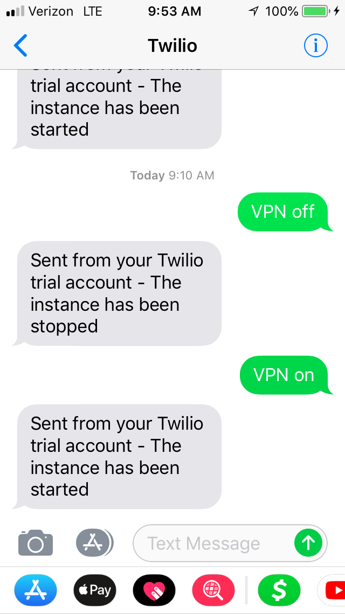
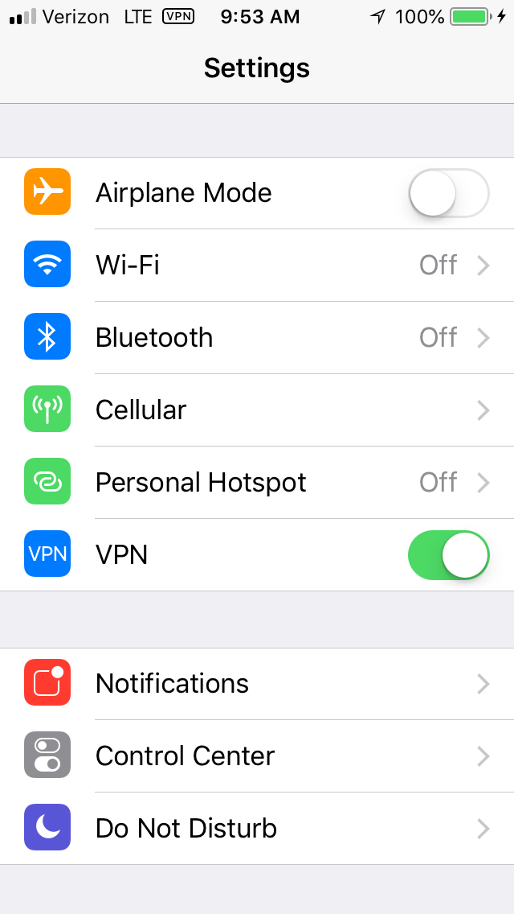
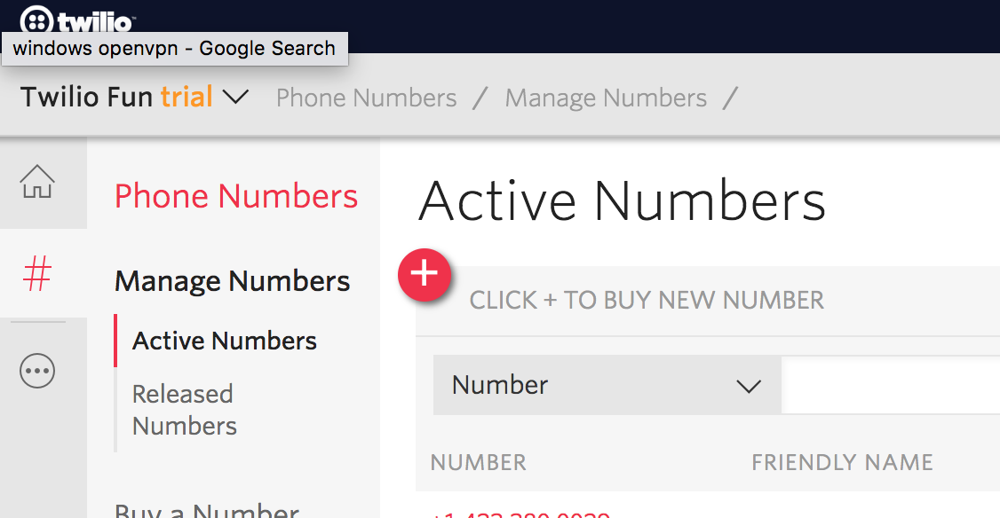
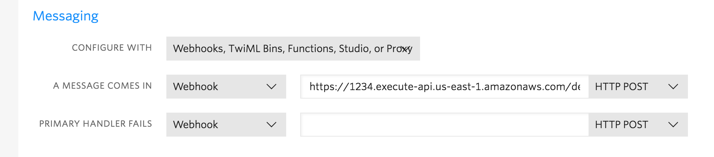

# VPN on Demand
Send text messages to start and stop your own VPN on AWS for super cheap.

   

Having a personal VPN gives you more control over logs and easily toggling the VPN instance can keep costs way down.
This approach does it by combining the following tools:
 - AWS t2.nano instance running OpenVPN
 - A Twilio phone number to receive the text messages
 - An API via AWS Lambda and API Gateway to receive requests from Twilio and start/stop the EC2 instance

### Set Up

Clone the repo:
```bash
git clone https://github.com/mcrowson/vpn_on_demand
cd vpn_on_demand
```

This guide uses Python 3.6 and [jq](https://stedolan.github.io/jq/). jq just makes things a little easier
when pulling data out of the AWS CLI JSON responses.

#### The VPN Instance
The instance here is a t2.nano running OpenVPN. Let's launch an EC2 instance using the [AWS CLI](https://aws.amazon.com/cli/)

The instance should only have port 1194 open for the VPN, but we'll need to shell into it for the setup. So the security
group will have both ports 22 and 1194 open initially. We will close port 22 after setup is complete.

```bash
SECURITY_GROUP=$(aws ec2 create-security-group --description "OpenVPN Port" --group-name VPN --output text)
aws ec2 authorize-security-group-ingress --protocol udp --port 1194 --cidr 0.0.0.0/0 --group-id $SECURITY_GROUP
aws ec2 authorize-security-group-ingress --protocol tcp --port 22 --cidr 0.0.0.0/0 --group-id $SECURITY_GROUP
```


Now that we have a security group, we are almost ready to launch the instance. First we will need to create a key pair
to login to the instance with. If you already have a named key pair that you want to use, skip this step. This command
lets AWS create a keypair, and saves your private key to ~/.ssh/vpn_key.pem. We will use this key to shell into the EC2
instance.

```bash
aws ec2 create-key-pair --key-name VPN --output json | jq -r ".KeyMaterial" > ~/.ssh/vpn_key.pem
chmod 400 ~/.ssh/vpn_key.pem
```

We are ready to launch the instance! The command below will launch an EC2 instance with the security group and the key
pair we made above. The image-id given here is the latest Amazon Linux 2 at the time of writing. Once we launch
the instance we also want to get the public IP so we can shell in and setup OpenVPN. We show the public IP
because we will need it when setting up the VPN.

```bash
INSTANCE_ID=$(aws ec2 run-instances --tag-specifications 'ResourceType=instance,Tags=[{Key=Name,Value=VPN_Instance}]' --image-id ami-04681a1dbd79675a5 --instance-type t2.nano --key-name VPN --associate-public-ip-address --output json --security-group-ids $SECURITY_GROUP | jq -r ".Instances[] | .InstanceId")
PUBLIC_IP=$(aws ec2 describe-instances --instance-ids $INSTANCE_ID --query 'Reservations[*].Instances[*].PublicIpAddress' --output text)
echo $PUBLIC_IP
```

Once the instance finishes launching, shell into the box so we can setup OpenVPN.

```bash
ssh -i ~/.ssh/vpn_key.pem ec2-user@$PUBLIC_IP
```

Now that you're in the instance, add docker. This makes setting up OpenVPN super easy.

```bash
sudo yum update -y
sudo yum install -y docker
sudo service docker start
sudo usermod -a -G docker ec2-user
exit
```

At this point you've need to logout and need to log back in to pickup the group permissions. Once you're back in the instance.
The OpenVPN comes from [https://github.com/kylemanna/docker-openvpn](https://github.com/kylemanna/docker-openvpn).
For our purposes we mostly follow the quickstart steps on the README there and make two changes:
- Replace VPN.SERVERNAME.COM with your public ip that we've echoed above. You will also give this in the `Common Name`
prompt when following the instructions in the README.
- Add `--restart always` to the OpenVPN container so it restarts when we restart the instance. It would look like:

`docker run -v $OVPN_DATA:/etc/openvpn -d -p 1194:1194/udp --restart always --cap-add=NET_ADMIN --name ovpn kylemanna/openvpn`

After finishing the Quickstart guide there, you should have some CLIENTNAME.ovpn file on the instance.

Log out of the instance and copy your new key to your local machine.
```bash
scp -i ~/.ssh/vpn_key.pem ec2-user@$PUBLIC_IP:CLIENTNAME.ovpn CLIENTNAME.ovpn
```

Now open up your favorite OpenVPN client and try to connect with your new key. If everything has worked correctly you
should be able to Google "what's my ip" and it shows you the public ip of your instance.

With a working key locally, we can turn off port 22 now. No more shelling needs.
```bash
aws ec2 revoke-security-group-ingress --group-id $SECURITY_GROUP --protocol tcp --port 22 --cidr 0.0.0.0/0
```

Now load up your favorite mobile OpenVPN client for iOS or Android and put your key on your phone (different approaches
here based on mobile platform).

#### Create Your Free Twilio Account
Setup a phone number that can receive your text messages and fire off the events for starting
and stopping your VPN. Twilio has a free tier that allows you to have a single phone number. This
phone number can only be used to call/message approved phone numbers.

- Head over to [Twilio](https://www.twilio.com/) and signup/login.
- Create a Project
- From the [Twilio Console](https://www.twilio.com/console) grab the ACCOUNT SID and AUTH TOKEN values. We will need those later.
- Navigate to the [Purchase a Number](https://www.twilio.com/console/phone-numbers/search) page and buy a new number with SMS capabilities.



- Add your personal phone number to the list of [Verified Callers](https://www.twilio.com/console/phone-numbers/verified)

#### Deploy the API
The API will be running on a combination of AWS Lambda and API Gateway powered via [Zappa](https://github.com/Miserlou/Zappa).

There are a few pieces of information we need to customize here for your implementation. Open up
the `zappa_settings.json` file:

- Set the environment variables.
```json
{
    "TWILIO_ACCOUNT_SID": "your_value",  # The ACCOUNT SID value from the Twilio console
    "TWILIO_AUTH_TOKEN": "your_value",  # The AUTH TOKEN value from the Twilio console
    "TWILIO_PHONE_NUMBER": "+14565557890",  # The Twilio phone number you purchased
    "ALLOWED_SENDER": "+14565557890",  # Your cell phone number that was verified on Twilio
    "EC2_INSTANCE_ID": "i-1234567890",  # The instance id of your VPN
    "EC2_REGION": "us-east-1"  # The region of your EC2 instance
}
```

- Replace EC2_INSTANCE_ID in the `extra_permissions` setting with your actual instance id to give lambda permisions to turn it on/off
- Replace the value in `s3_bucket` with the name of a bucket for holding your project during deployment.
You can set this to some random value and Zappa will create the bucket for you.

Once that is done, create a virtual environment and deploy the API.

```bash
python3.6 -m venv env
source env/bin/activate
pip install -r requirements.txt
zappa deploy
```

When the deployment process finishes, Zappa spits out your new API Gateway URL.

#### Tell Twilio to Send Messages to Your API
The API is live now. So we are going back to Twilio to tell it to send incoming messages to the API.
- Go to the [Twilio Phone Numbers](https://www.twilio.com/console/phone-numbers/incoming) page and select your number.
- Towards the bottom of the page, add your API Gateway endpoint to the incoming
message as a webhook.



When your new number recieves a text, it will send a POST request to the API we have deployed.

That's it! Try sending some texts to the Twilio phone number with "VPN on" and "VPN off" to make sure it works.

If you remember to turn off the VPN when you're done using it, costs should be pennies.
